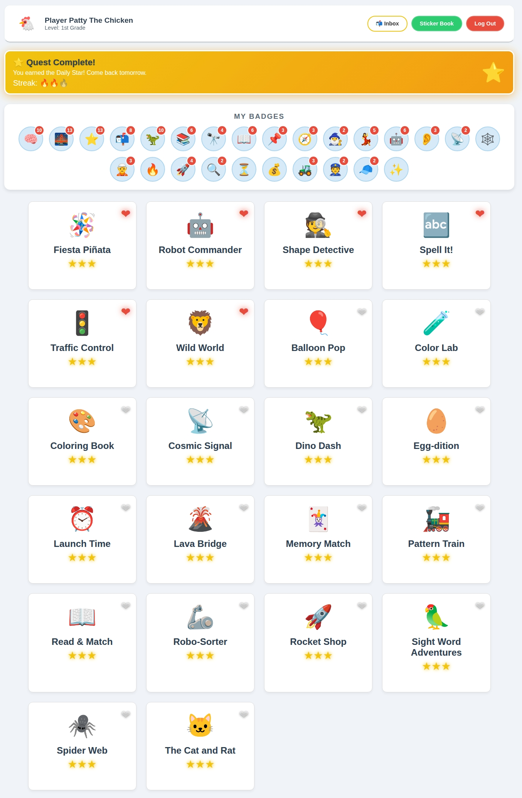

# 🎓 Nuken LMS: Walled Garden Education

   

**A self-hosted, "Walled Garden" Learning Management System (LMS) designed for safe, distraction-free home education.**

Nuken LMS allows parents and educators to host a private server where students can learn, track progress, and socialize safely without exposure to the open internet.

[](Screenshots#readme/)
> *[Click here to view the full Screenshot Gallery](Screenshots#readme/)*

**🎯 Target Audience:**
Currently pre-loaded with content optimized for **Preschool to 3rd Grade** (Literacy, Basic Math, Logic). However, the platform is **grade-agnostic**—it is built to grow with your students, allowing you to easily develop or install modules for older age groups (Coding, Advanced Math, Typing, etc.).

[](https://buymeacoffee.com/rcvaughn2)
---

## 📋 Table of Contents
- [The Walled Garden](#walled-garden)
- [LMS Features](#lms-features)
- [Included Modules](#included-modules)
- [Installation](#installation)
- [Developer API](#developer-api)

---

## <a id="walled-garden"></a>🛡️ The Walled Garden
The core philosophy is complete isolation from the "wild web."
* **Zero External Footprint:** No Google Analytics, no third-party fonts, and no outbound links.
* **Internal Messaging System:** Students can send messages (e.g., emojis, encouragement) to family members or other students *only* within the local system.
* **Data Sovereignty:** All progress data, messages, and user accounts reside 100% on your own server.

---

## <a id="lms-features"></a>✨ LMS Features

### 📈 Built for Growth
* **Grade-Level Filtering:** The database supports `min_grade` and `max_grade` parameters. As you add complex games for older kids, they will only appear for students in those grades.
* **Scalable Engine:** The "GameBridge" API handles simple matching games just as easily as complex logic puzzles or typing tutors.

### 👨‍🏫 For Administrators (Parents/Teachers)
* **Student Management:** Create accounts with secure **PIN Code Login** for easy access.
* **Granular Analytics:** View detailed Report Cards showing scores, completion time, and specific mistake counts.
* **Adaptive Theming:** The interface and *game content* adapt to the student's interest (e.g., "Robo-Sorter" becomes "Unicorn Sorter" in the Fairy Tale theme).
* **Security Lockouts:** Built-in protection against brute-force PIN guessing.

### 🎓 For Students
* **Personalized Dashboard:** Students can "Favorite" specific exercises for quick access.
* **Gamified Learning:** Earn badges (e.g., "Word Wizard", "Streak Master") and unlock visual rewards.
* **Voice Guidance:** Integrated Text-to-Speech acts as a personal tutor, reading instructions aloud.
* **Safe Socializing:** Unlock the "Messenger Box" badge to send safe, local messages to parents or siblings.

---

## <a id="included-modules"></a>📚 Included Learning Modules

The LMS comes pre-loaded with over 20 curriculum-aligned titles for early learners:

| Subject | Modules |
| :--- | :--- |
| **Literacy & Language** | Alphabet Fun, Sight Word Adventures, Read & Match, Spell It!, Wild World (Animals), The Cat and Rat, Cosmic Signal (Reading), Fiesta Piñata (Spanish) |
| **Math & Logic** | Egg-dition (Arithmetic), Robo-Sorter (Categorization), Rocket Shop (Currency), Launch Time (Analog Clocks), Pattern Train, Spider Web (Geometry) |
| **Executive Function** | Robot Commander (Auditory Processing/Simon Says), Traffic Control (Impulse Control/Red Light) |
| **Motor Skills** | Balloon Pop, Lava Bridge |
| **Creativity** | Coloring Book, Color Lab |

---

## <a id="installation"></a>🚀 Installation

### Option A: Docker (Recommended)
Ideal for home labs (Portainer/Docker Compose).

1.  **Clone the Repository**
    ```bash
    git clone https://github.com/nuken/kid-games.git
    cd kid-games
    ```

2.  **Configure Environment**
    * Rename `includes/config.sample.php` to `includes/config.php`.
    * Edit `includes/config.php` with secure credentials.
    * **Update Docker Compose:** Ensure `MYSQL_USER` and `MYSQL_PASSWORD` in `docker-compose.yml` match your config.

3.  **Start Services**
    ```bash
    docker-compose up -d
    ```
    Access the LMS at `http://localhost:8080`.

4.  **Finish Setup**
    * Visit `http://localhost:8080/install.php` to create your **Admin** account.

### Option B: Standard Hosting (LAMP/cPanel)
1.  **Upload:** Upload files to your server's `public_html`.
2.  **Database:** Create a MySQL/MariaDB database.
3.  **Config:** Rename and edit `includes/config.php` with your database details.
4.  **Install:** Run the installer at `yoursite.com/install.php`.

> **⚠️ Security:** The installer attempts to self-destruct. If `install.php` remains after setup, manually delete it.

---

## <a id="developer-api"></a>🧩 Curriculum Development

Expand the LMS with your own modules using the **GameBridge API**.

* **[📖 Read the Developer Guide](examples/DEVELOPER_GUIDE.md)**

### API Capabilities
* **Data Sync:** `GameBridge.saveScore({...})` automatically syncs results to the student's report card.
* **TTS Engine:** `GameBridge.speak("Select the square")` utilizes browser-native speech.
* **Theme Awareness:** Detect the active LMS theme (Space/Princess/Default) to swap game assets dynamically.

---

## <a id="technology-stack"></a>🛠️ Technology Stack

* **Core:** PHP 7.4+ (Tested on 8.4)
* **Data:** MariaDB / MySQL
* **Frontend:** Vanilla Javascript, HTML5, PWA Support
* **Delivery:** Docker & Docker Compose
